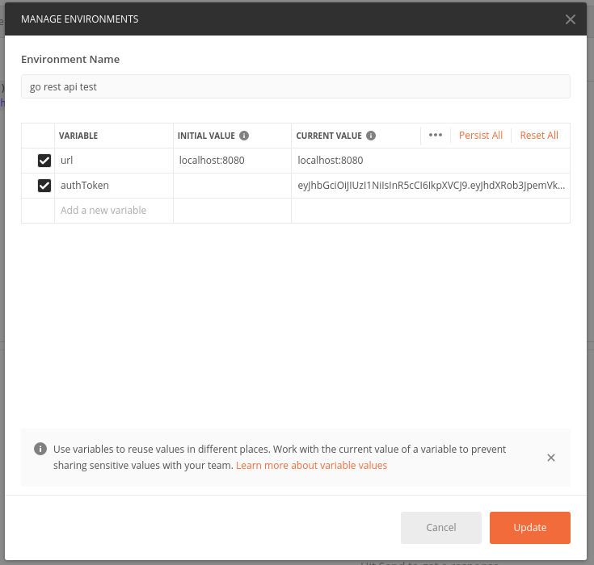
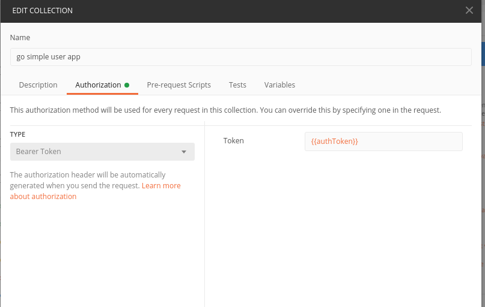
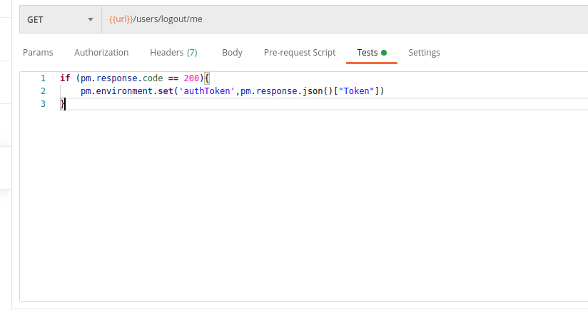
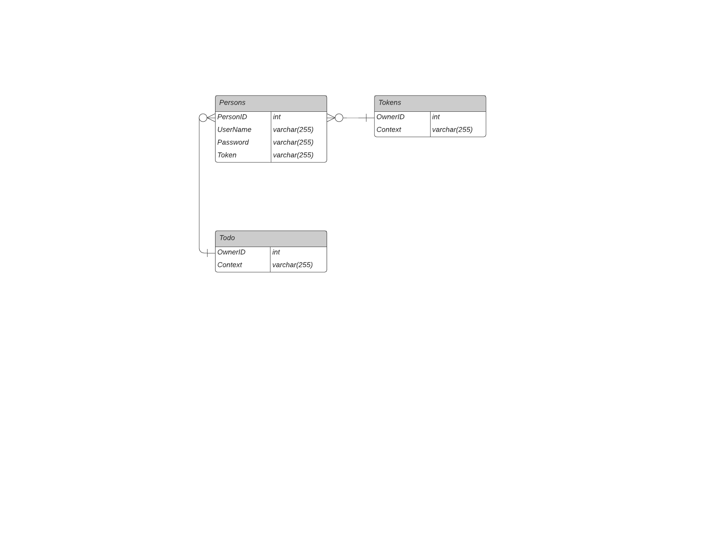

# RESTful API in GO

This is an intermediate-level go project that running with a project structure optimized RESTful API service in Go. API's of that project is designed based on solid and common principles and connected to the local MySQL database.

<b>Highlights of that project are listed at below </b>
  - The RESTful API presents standard CRUD operations of a database table
  - This project has clean architecture and it has been covered with tests.
  - Data validation
  - It uses JWT-based authentication and auth middleware.
  - Each token is expired in 15 minutes to prevent system bugs.
  - Error handling is done with clear responses.
  - It presents structured logging with the username, password for 15 minutes with help of a token that is created by JWT. After that, the user can create TODOs. 
  - <b> The project used the following packages during the development time </b>
      - Routing : <a href="github.com/gorilla/mux">Mux</a>
      - Database driver : <a href="github.com/go-sql-driver/mysql">Mysql</a>
      - JWT : <a href="github.com/dgrijalva/jwt-go">go-jwt</a>
      - Test : <a href="github.com/stretchr/testify">Testify</a>

## Getting Started

If you're have not encountered Go before, you should visit this website <a target="_blank" href="https://golang.org/doc/install">here</a>

After installing Go , you should run the following commands to experience this project

```cmd
# download the starter code
git clone https://github.com/Kivanc10/golang-rest-api-with-mysql.git

# open the code
cd golang-rest-api-with-mysql

# start the database server and run the code
go run ./operate/operate.go
```
After that, you have a RESTful API that is running at `http://127.0.0.1:8080`. It provides us following endpoints
  - `GET /users` : it provides us the list of all users logged-in
  - `POST /signUp` : it allows the user to sign up. It saves the user info into db and creates token with JWT.It accepts attached data like that:
    - `PersonID` can be anything because db arranged to auto increment
    - ```JSON
      {
          "PersonID":0,
          "UserName":"sample user name",
          "Password":"12312321"
       }
      ```
  - `POST /signIn` : authenticates and login. It creates token again with JWT.It accepts attached data to , something like up above.
  - `GET /users/me` : It allows the user to access his information.To do this , user must be authenticated,otherwise system wil not let that happen
  - `PUT /users/update/me` : It updates the current authenticated user with accepted data.To do this user must be authenticated.It accepts attached data like:
      - ```JSON
        {
              "PersonID":0,
              "UserName":"new user name",
              "Password":"new password"
        }
        ```
  - `DELETE /user/me` : It deletes the current authenticated user.To do this user must be authenticated.
  - `GET /users/logout/me` : It allows the user to logout from all tokens.To do this user must be authenticated.The user will be not deleted from db.
  - `POST /todo` : It allows the user to create todos. To do this user must be authenticated.It accepts attached data like that :
      - ```JSON
            {
                "Context" : "sample todo"
             }
          ```
  - `GET /todos` : It lists all todos that created by authenticated users.
  - `GET /todos/me` : It lists just the todos belong to the current user authenticated


### If you have API client tools like `Postman`, you can handle complicated operations easily

If you create a new environment in Postman and declare variables you'll use , you make everything clear.



You also should add a set of codes in the test section of some requests arrange automatically with the bearer token of the header of the request.(`signup,login,getme,update,logout`)
Before the code,you should define an environment token named `authToken` in section of Authorization of edit collection.



Then past the code in `signup,login,getme,update,logout` requests

```JavaScript
if (pm.response.code == 200){
    pm.environment.set('authToken',pm.response.json()["Token"])
}
```


After that,your header of the request will updated by valid tokens automatically to authenticate.

You must ensure that you choose that environment


### how to use endpoints
```
# sign up the user via POST /signUp
curl -X POST -H "Content-Type: application/json" -d `{ "PersonID":0,"UserName":"sample user name","Password":"12312321"}` http://localhost:8080/signUp
# it should return response.header with jwt and token

# sign in with user via POST /signIn
curl -X POST -H "Content-Type: application/json" -d `{ "PersonID":0,"UserName":"sample user name","Password":"12312321"}` http://localhost:8080/signIn
# it should return response.Header with jwt and token
# save token during the loggedin and inherit auth from postman environment,it handles itself
curl -X GET -H "Authorization: Bearer ...JWT token here..." http://localhost:8080/users/me

# to create todos for the user authenticated
curl -X POST -H "Authorization: Bearer ...JWT token here..." -d `{"Context" : "sample todo"}` http://localhost:8080/todo
# it returns the saved todo belong to the user authenticated
```

#### Project layout

```bash
.
├── dbOp                 main database operations of the project
├── middleware           auth middleware and tokens will create
├── operate              main application of the project
├── route                routes operations of the project related to RESTful api functions
└── static               static files belong to the project
```

### Working with JWT based authenticaton and auth middleware

##### JWT
  - JSON Web Token (JWT) is a self-contained way for securely transmitting information between parties as a JSON object. If you will deal with authorization and information exchange, the most logical thing you will do is use JWT.

##### Auth middleware
  - We have the authentication service and its adapter and the login middleware in place, we can create middleware that checks for authenticated users, having it redirect to the /login page if the user is not authenticated

In that project,we create tokens if necessary such as `signUp,signIn,...` to make and save changes.Then we use auth middleware to access the current user if its token is valid. Auth middleware allows us to design a real secure system.

#### to create tokens

```Go

func CreateToken(userId uint64, name string) (string, error) { // it accepts userId and username
/* This function creates a token belong to the user with a set of information. The created token will be expired in 15 minutes */
	var err error
	//Creating Access Token
	os.Setenv("ACCESS_SECRET", mySignInKey) // define a global access key
	atClaims := jwt.MapClaims{} // create empty map to store keys-values belong to the user
  # store infos into the map
	atClaims["authorized"] = true
	atClaims["user_id"] = userId
	atClaims["user_name"] = name
	atClaims["exp"] = time.Now().Add(time.Minute * 15).Unix() // token is valid for 15 minutes
	at := jwt.NewWithClaims(jwt.SigningMethodHS256, atClaims) // use HS256 algorithm
	token, err := at.SignedString([]byte(os.Getenv("ACCESS_SECRET")))
	if err != nil { // error handling
		return "", errors.New("an error occured during the create token")
	}
	fmt.Println("jwt map --> ", atClaims)
	return token, nil // return token created and no error if succeed
}
```

#### to integrate auth middleware

```Go
func MiddleWare(next http.Handler) http.Handler {
	return http.HandlerFunc(func(w http.ResponseWriter, r *http.Request) {
		
		 
			authHeader := strings.Split(r.Header.Get("Authorization"), "Bearer ") // split request header acc. to Bearer 
			fmt.Printf("authheader -> %s and len -> %d\n", authHeader, len(authHeader))
			if len(authHeader) != 2 || authHeader[0] == "null" { // ["Bearer ","Token..."],if it is not like that,there is an error there
				//fmt.Println("Malformed token")
				w.WriteHeader(http.StatusUnauthorized)
				w.Write([]byte("Malformed Token"))
				log.Fatal("Malformed token")
        }
			
				jwtToken := authHeader[1] // get the token
				token, err := jwt.Parse(jwtToken, func(token *jwt.Token) (interface{}, error) { // parse the token
					if _, ok := token.Method.(*jwt.SigningMethodHMAC); !ok {
						return nil, fmt.Errorf("Unexpected signing method: %v", token.Header["alg"])
					}
					return []byte(mySignInKey), nil
				})
        // type conversion with jwt.MapClaims and to check the token is valid
				if claims, ok := token.Claims.(jwt.MapClaims); ok && token.Valid { // if that token is valid
					ctx := context.WithValue(r.Context(), "props", claims) // props is context key
					// Access context values in handlers like this					
					next.ServeHTTP(w, r.WithContext(ctx)) // if succeed serve http with context

				} else { // if there is an error
					fmt.Println("token err -> ", err)
					//r.Header.Set("ExpiredToken", jwtToken)
					//DelTokenIfExpired(jwtToken)
					// usernameInter := claims["user_name"]
					// if username, ok := usernameInter.(fmt.Stringer); ok {
					// 	person := dbop.GetPersonToDelToken(username.String())
					// 	dbop.DeleteTokenIfExpired(person)
					// }

					w.WriteHeader(http.StatusUnauthorized)
					w.Write([]byte("you are Unauthorized or your token is expired"))
				}
			
		}

	})
}
```

### Database scheme


